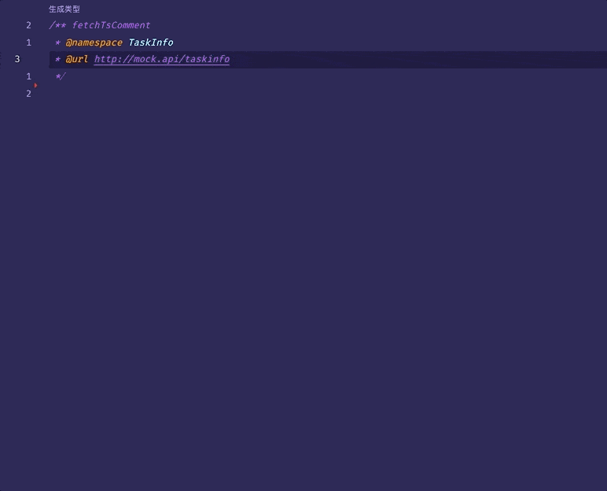

# fetch-ts-type README

配置请求接口，根据响应结果生成 TS 类型，本地远程不一致时会生成 diff。

## TodoList

- 自定义 diff 策略
- 请求方法、cookie
- 插件系统

## Features

### 代码提示
输入 `/**` 可以自动生成代码注释

### 配置项

- `namespace`：生成类型的 `namespace`
- `url`：请求 `url`

字段配置完成后，点击「生成类型」即可。

如果之前没有生成过即会插入代码，如果生成过就会进行 `diff` 并替换代码。